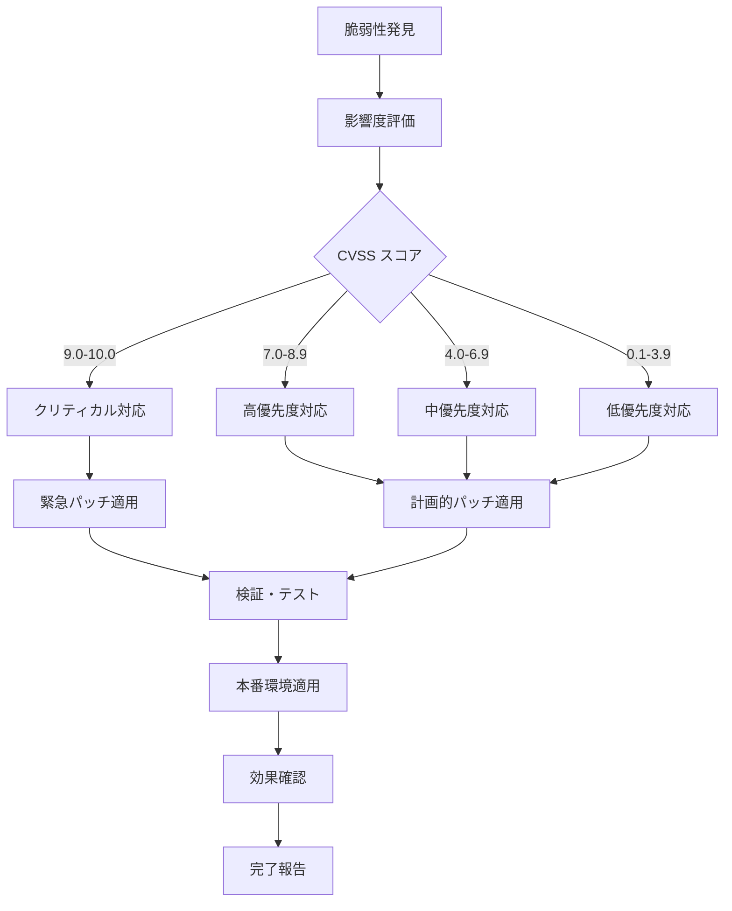

# PeerLearningHub セキュリティガイドライン

## 概要

PeerLearningHub v1.0.0のセキュリティベストプラクティス、インシデント対応手順、セキュリティ監査チェックリストを定義します。

## 目次

1. [セキュリティベストプラクティス](#セキュリティベストプラクティス)
2. [インシデント対応手順](#インシデント対応手順)
3. [セキュリティ監査チェックリスト](#セキュリティ監査チェックリスト)
4. [脆弱性管理](#脆弱性管理)
5. [データ保護](#データ保護)
6. [アクセス制御](#アクセス制御)
7. [監視・検知](#監視検知)
8. [コンプライアンス](#コンプライアンス)

## セキュリティベストプラクティス

### 1. 認証・認可

#### パスワードセキュリティ
```typescript
// 強力なパスワードポリシー
const passwordPolicy = {
  minLength: 12,
  requireUppercase: true,
  requireLowercase: true,
  requireNumbers: true,
  requireSpecialChars: true,
  prohibitCommonPasswords: true,
  prohibitPersonalInfo: true,
  maxAge: 90, // days
  historyCount: 12, // previous passwords to remember
  lockoutThreshold: 5, // failed attempts
  lockoutDuration: 30, // minutes
};

// パスワード強度チェック
const validatePasswordStrength = (password: string, userInfo: UserInfo): ValidationResult => {
  const checks = [
    { test: password.length >= 12, message: 'パスワードは12文字以上である必要があります' },
    { test: /[A-Z]/.test(password), message: '大文字を含む必要があります' },
    { test: /[a-z]/.test(password), message: '小文字を含む必要があります' },
    { test: /\d/.test(password), message: '数字を含む必要があります' },
    { test: /[!@#$%^&*]/.test(password), message: '特殊文字を含む必要があります' },
    { test: !isCommonPassword(password), message: '一般的なパスワードは使用できません' },
    { test: !containsPersonalInfo(password, userInfo), message: '個人情報を含むパスワードは使用できません' },
  ];

  const failedChecks = checks.filter(check => !check.test);
  return {
    isValid: failedChecks.length === 0,
    errors: failedChecks.map(check => check.message),
    strength: calculatePasswordStrength(password),
  };
};
```

#### 多要素認証（MFA）
```typescript
// MFA設定
const mfaConfig = {
  enabled: true,
  methods: ['totp', 'sms', 'email'],
  backupCodes: {
    count: 10,
    length: 8,
    expiryDays: 90,
  },
  gracePeriod: 7, // days for new users
};

// TOTP実装
class TOTPService {
  generateSecret(): string {
    return speakeasy.generateSecret({
      name: 'PeerLearningHub',
      issuer: 'PeerLearningHub',
      length: 32,
    }).base32;
  }

  verifyToken(secret: string, token: string): boolean {
    return speakeasy.totp.verify({
      secret,
      encoding: 'base32',
      token,
      window: 2, // Allow 2 time steps of variance
    });
  }
}
```

#### セッション管理
```typescript
// セキュアセッション設定
const sessionConfig = {
  timeout: 8 * 60 * 60, // 8 hours
  refreshThreshold: 60 * 60, // 1 hour before expiry
  maxConcurrentSessions: 3,
  secureFlags: {
    httpOnly: true,
    secure: true,
    sameSite: 'strict',
  },
  rotateOnLogin: true,
  invalidateOnSuspiciousActivity: true,
};

// セッション検証
const validateSession = async (sessionToken: string): Promise<SessionValidation> => {
  const session = await getSession(sessionToken);
  
  if (!session) {
    return { valid: false, reason: 'Session not found' };
  }

  if (session.expiresAt < new Date()) {
    await invalidateSession(sessionToken);
    return { valid: false, reason: 'Session expired' };
  }

  if (session.suspiciousActivity) {
    await invalidateSession(sessionToken);
    return { valid: false, reason: 'Suspicious activity detected' };
  }

  return { valid: true, session };
};
```

### 2. データ暗号化

#### 保存時暗号化
```typescript
// フィールドレベル暗号化
class FieldEncryption {
  private readonly algorithm = 'aes-256-gcm';
  private readonly keyDerivation = 'pbkdf2';

  async encryptField(data: string, masterKey: string): Promise<EncryptedField> {
    const salt = crypto.randomBytes(16);
    const iv = crypto.randomBytes(12);
    
    const key = crypto.pbkdf2Sync(masterKey, salt, 100000, 32, 'sha256');
    const cipher = crypto.createCipher(this.algorithm, key, { iv });
    
    let encrypted = cipher.update(data, 'utf8', 'hex');
    encrypted += cipher.final('hex');
    
    const authTag = cipher.getAuthTag();
    
    return {
      encrypted,
      salt: salt.toString('hex'),
      iv: iv.toString('hex'),
      authTag: authTag.toString('hex'),
    };
  }

  async decryptField(encryptedField: EncryptedField, masterKey: string): Promise<string> {
    const salt = Buffer.from(encryptedField.salt, 'hex');
    const iv = Buffer.from(encryptedField.iv, 'hex');
    const authTag = Buffer.from(encryptedField.authTag, 'hex');
    
    const key = crypto.pbkdf2Sync(masterKey, salt, 100000, 32, 'sha256');
    const decipher = crypto.createDecipher(this.algorithm, key, { iv });
    decipher.setAuthTag(authTag);
    
    let decrypted = decipher.update(encryptedField.encrypted, 'hex', 'utf8');
    decrypted += decipher.final('utf8');
    
    return decrypted;
  }
}
```

#### 転送時暗号化
```typescript
// TLS設定
const tlsConfig = {
  minVersion: 'TLSv1.3',
  ciphers: [
    'TLS_AES_256_GCM_SHA384',
    'TLS_CHACHA20_POLY1305_SHA256',
    'TLS_AES_128_GCM_SHA256',
  ],
  certificatePinning: {
    enabled: true,
    pins: [
      'sha256/AAAAAAAAAAAAAAAAAAAAAAAAAAAAAAAAAAAAAAAAAAA=',
      'sha256/BBBBBBBBBBBBBBBBBBBBBBBBBBBBBBBBBBBBBBBBBBB=',
    ],
  },
};

// 証明書ピニング実装
const validateCertificate = (certificate: Certificate): boolean => {
  const publicKeyHash = crypto
    .createHash('sha256')
    .update(certificate.publicKey)
    .digest('base64');
    
  return tlsConfig.certificatePinning.pins.includes(`sha256/${publicKeyHash}`);
};
```

### 3. 入力検証・サニタイゼーション

#### 入力検証
```typescript
// 包括的入力検証
class InputValidator {
  static validateEmail(email: string): ValidationResult {
    const emailRegex = /^[^\s@]+@[^\s@]+\.[^\s@]+$/;
    const isValid = emailRegex.test(email) && email.length <= 254;
    
    return {
      isValid,
      sanitized: email.toLowerCase().trim(),
      errors: isValid ? [] : ['無効なメールアドレス形式です'],
    };
  }

  static validateText(text: string, maxLength: number = 1000): ValidationResult {
    // XSS攻撃対策
    const sanitized = text
      .replace(/<script\b[^<]*(?:(?!<\/script>)<[^<]*)*<\/script>/gi, '')
      .replace(/javascript:/gi, '')
      .replace(/on\w+\s*=/gi, '')
      .trim();

    // SQLインジェクション対策
    const sqlInjectionPattern = /(\b(SELECT|INSERT|UPDATE|DELETE|DROP|CREATE|ALTER|EXEC|UNION|SCRIPT)\b)/i;
    const hasSqlInjection = sqlInjectionPattern.test(sanitized);

    const isValid = sanitized.length <= maxLength && !hasSqlInjection;

    return {
      isValid,
      sanitized,
      errors: isValid ? [] : ['無効な文字が含まれています'],
    };
  }

  static validateUrl(url: string): ValidationResult {
    try {
      const parsedUrl = new URL(url);
      const allowedProtocols = ['https:', 'http:'];
      const isValid = allowedProtocols.includes(parsedUrl.protocol);

      return {
        isValid,
        sanitized: url,
        errors: isValid ? [] : ['無効なURL形式です'],
      };
    } catch {
      return {
        isValid: false,
        sanitized: url,
        errors: ['無効なURL形式です'],
      };
    }
  }
}
```

#### CSRFトークン
```typescript
// CSRF保護
class CSRFProtection {
  generateToken(): string {
    return crypto.randomBytes(32).toString('hex');
  }

  validateToken(sessionToken: string, csrfToken: string): boolean {
    const storedToken = this.getStoredToken(sessionToken);
    return storedToken && crypto.timingSafeEqual(
      Buffer.from(storedToken),
      Buffer.from(csrfToken)
    );
  }

  middleware(req: Request, res: Response, next: NextFunction): void {
    if (['POST', 'PUT', 'DELETE'].includes(req.method)) {
      const csrfToken = req.headers['x-csrf-token'] as string;
      const sessionToken = req.headers.authorization?.replace('Bearer ', '');

      if (!this.validateToken(sessionToken, csrfToken)) {
        return res.status(403).json({ error: 'Invalid CSRF token' });
      }
    }
    next();
  }
}
```

### 4. APIセキュリティ

#### レート制限
```typescript
// 高度なレート制限
class RateLimiter {
  private readonly limits = new Map<string, RateLimit>();

  constructor(private readonly config: RateLimitConfig) {}

  async checkLimit(identifier: string, endpoint: string): Promise<RateLimitResult> {
    const key = `${identifier}:${endpoint}`;
    const now = Date.now();
    const windowMs = this.config.windowMs;
    
    let limit = this.limits.get(key);
    if (!limit || now - limit.resetTime > windowMs) {
      limit = {
        count: 0,
        resetTime: now + windowMs,
        blocked: false,
      };
    }

    limit.count++;
    
    const maxRequests = this.getMaxRequests(endpoint);
    if (limit.count > maxRequests) {
      limit.blocked = true;
      await this.logSuspiciousActivity(identifier, endpoint, limit.count);
    }

    this.limits.set(key, limit);

    return {
      allowed: !limit.blocked,
      remaining: Math.max(0, maxRequests - limit.count),
      resetTime: limit.resetTime,
    };
  }

  private getMaxRequests(endpoint: string): number {
    const endpointLimits = {
      '/auth/login': 5,
      '/auth/signup': 3,
      '/posts': 100,
      '/posts/create': 10,
      '/upload': 5,
    };
    
    return endpointLimits[endpoint] || 60; // default
  }
}
```

#### API認証
```typescript
// JWT検証
class JWTValidator {
  private readonly secretKey: string;
  private readonly algorithm = 'HS256';

  constructor(secretKey: string) {
    this.secretKey = secretKey;
  }

  validateToken(token: string): TokenValidation {
    try {
      const decoded = jwt.verify(token, this.secretKey, {
        algorithm: this.algorithm,
        maxAge: '8h',
      }) as JWTPayload;

      // 追加検証
      if (decoded.iss !== 'PeerLearningHub') {
        throw new Error('Invalid issuer');
      }

      if (decoded.aud !== 'PeerLearningHub-API') {
        throw new Error('Invalid audience');
      }

      return {
        valid: true,
        payload: decoded,
      };
    } catch (error) {
      return {
        valid: false,
        error: error.message,
      };
    }
  }

  generateToken(payload: JWTPayload): string {
    return jwt.sign(
      {
        ...payload,
        iss: 'PeerLearningHub',
        aud: 'PeerLearningHub-API',
        iat: Math.floor(Date.now() / 1000),
      },
      this.secretKey,
      {
        algorithm: this.algorithm,
        expiresIn: '8h',
      }
    );
  }
}
```

### 5. セキュリティヘッダー

#### 必須セキュリティヘッダー
```typescript
const securityHeaders = {
  // XSS保護
  'Content-Security-Policy': [
    "default-src 'self'",
    "script-src 'self' 'unsafe-inline' https://trusted-cdn.com",
    "style-src 'self' 'unsafe-inline'",
    "img-src 'self' data: https:",
    "font-src 'self' https://fonts.gstatic.com",
    "connect-src 'self' https://api.peerlearninghub.com wss://realtime.supabase.co",
    "frame-ancestors 'none'",
    "base-uri 'self'",
    "form-action 'self'",
  ].join('; '),

  // クリックジャッキング保護
  'X-Frame-Options': 'DENY',

  // MIME タイプスニッフィング防止
  'X-Content-Type-Options': 'nosniff',

  // XSS フィルター
  'X-XSS-Protection': '1; mode=block',

  // リファラーポリシー
  'Referrer-Policy': 'strict-origin-when-cross-origin',

  // 権限ポリシー
  'Permissions-Policy': [
    'geolocation=()',
    'microphone=()',
    'camera=()',
    'payment=()',
    'usb=()',
  ].join(', '),

  // HSTS
  'Strict-Transport-Security': 'max-age=31536000; includeSubDomains; preload',

  // キャッシュ制御
  'Cache-Control': 'no-store, no-cache, must-revalidate, private',
  'Pragma': 'no-cache',
  'Expires': '0',
};
```

## インシデント対応手順

### 1. インシデント分類

#### セキュリティインシデントレベル

| レベル | 説明 | 対応時間 | エスカレーション |
|--------|------|----------|------------------|
| **P1 - クリティカル** | データ漏洩、システム侵害 | 即座（15分以内） | CEO、CTO、全セキュリティチーム |
| **P2 - 高** | 不正アクセス試行、脆弱性悪用 | 1時間以内 | セキュリティチーム、開発チーム |
| **P3 - 中** | 異常なアクセスパターン | 4時間以内 | セキュリティ担当者 |
| **P4 - 低** | セキュリティ設定の軽微な問題 | 24時間以内 | 運用担当者 |

### 2. インシデント対応フロー

#### 初期対応（0-15分）
```bash
# 1. インシデント確認
./scripts/security/verify-incident.sh

# 2. 影響範囲の特定
./scripts/security/assess-impact.sh

# 3. 緊急措置の実行
./scripts/security/emergency-response.sh

# 4. 関係者への通知
./scripts/security/notify-stakeholders.sh
```

#### 封じ込め（15分-1時間）
```bash
# 1. 攻撃の遮断
./scripts/security/block-attack.sh

# 2. 影響を受けたアカウントの無効化
./scripts/security/disable-compromised-accounts.sh

# 3. システムの隔離（必要に応じて）
./scripts/security/isolate-systems.sh

# 4. 証拠の保全
./scripts/security/preserve-evidence.sh
```

#### 根絶・復旧（1時間-24時間）
```bash
# 1. 脆弱性の修正
./scripts/security/patch-vulnerabilities.sh

# 2. システムの復旧
./scripts/security/restore-systems.sh

# 3. セキュリティ設定の強化
./scripts/security/harden-security.sh

# 4. 監視の強化
./scripts/security/enhance-monitoring.sh
```

### 3. インシデント報告テンプレート

```markdown
# セキュリティインシデント報告書

## 基本情報
- **インシデントID**: SEC-2024-001
- **発生日時**: 2024-01-01 12:00:00 JST
- **発見日時**: 2024-01-01 12:05:00 JST
- **報告者**: [名前]
- **重要度**: P1 / P2 / P3 / P4
- **ステータス**: 調査中 / 対応中 / 解決済み

## インシデント概要
### 何が起こったか
[インシデントの詳細な説明]

### 影響範囲
- **影響を受けたシステム**: 
- **影響を受けたユーザー数**: 
- **データの種類**: 
- **推定損害**: 

### 攻撃手法
- **攻撃ベクター**: 
- **使用された脆弱性**: 
- **攻撃者の特徴**: 

## 対応状況
### 実施した対策
1. [対策1]
2. [対策2]
3. [対策3]

### 現在の状況
[現在の対応状況]

### 次のアクション
- [ ] [アクション1]
- [ ] [アクション2]
- [ ] [アクション3]

## 根本原因分析
### 原因
[根本原因の分析]

### 再発防止策
1. [防止策1]
2. [防止策2]
3. [防止策3]

## 学んだ教訓
[今回のインシデントから学んだこと]

## 添付資料
- ログファイル
- スクリーンショット
- ネットワーク分析結果
```

### 4. 緊急連絡先

#### 内部連絡先
```
セキュリティチーム:
- Email: security@peerlearninghub.com
- Slack: #security-incidents
- 緊急電話: [セキュリティ責任者直通]

経営陣:
- CEO: [連絡先]
- CTO: [連絡先]
- CISO: [連絡先]

法務・コンプライアンス:
- Email: legal@peerlearninghub.com
- 電話: [法務部直通]
```

#### 外部連絡先
```
サイバーセキュリティ専門会社:
- 会社名: [セキュリティベンダー]
- 緊急対応: [24時間対応番号]
- Email: [緊急対応メール]

法執行機関:
- サイバー犯罪対策課: [連絡先]
- 警察署: [管轄署連絡先]

規制当局:
- 個人情報保護委員会: [連絡先]
- 業界規制機関: [連絡先]
```

## セキュリティ監査チェックリスト

### 1. 月次セキュリティ監査

#### 認証・認可システム
- [ ] パスワードポリシーの遵守状況確認
- [ ] MFA有効化率の確認（目標: 95%以上）
- [ ] 休眠アカウントの特定と無効化
- [ ] 権限の最小化原則の遵守確認
- [ ] 管理者アカウントの定期レビュー

#### アクセス制御
- [ ] RLSポリシーの有効性確認
- [ ] API認証の動作確認
- [ ] セッション管理の適切性確認
- [ ] 不正アクセス試行の分析
- [ ] アクセスログの異常検知

#### データ保護
- [ ] 暗号化設定の確認
- [ ] バックアップの暗号化確認
- [ ] 個人情報の適切な取り扱い確認
- [ ] データ保持期間の遵守確認
- [ ] データ削除プロセスの実行確認

### 2. 四半期セキュリティ監査

#### 脆弱性管理
- [ ] 依存関係の脆弱性スキャン実行
- [ ] セキュリティパッチの適用状況確認
- [ ] ペネトレーションテストの実施
- [ ] コードセキュリティレビューの実施
- [ ] 脆弱性対応プロセスの評価

#### インフラセキュリティ
- [ ] ネットワークセキュリティ設定確認
- [ ] ファイアウォール設定の見直し
- [ ] SSL/TLS証明書の有効期限確認
- [ ] セキュリティヘッダーの設定確認
- [ ] CDN・WAF設定の確認

#### 監視・検知
- [ ] セキュリティ監視システムの動作確認
- [ ] アラートルールの有効性確認
- [ ] ログ収集・分析システムの確認
- [ ] インシデント対応プロセスの訓練
- [ ] セキュリティメトリクスの評価

### 3. 年次セキュリティ監査

#### 包括的セキュリティ評価
- [ ] セキュリティポリシーの見直し
- [ ] リスクアセスメントの実施
- [ ] 事業継続計画の確認
- [ ] 災害復旧計画のテスト
- [ ] サードパーティセキュリティ評価

#### コンプライアンス確認
- [ ] 個人情報保護法の遵守確認
- [ ] 業界標準（ISO27001等）の遵守確認
- [ ] 契約上のセキュリティ要件の確認
- [ ] 監査証跡の完全性確認
- [ ] セキュリティ教育の実施状況確認

### 4. 監査チェックスクリプト

#### 自動セキュリティチェック
```bash
#!/bin/bash
# security-audit.sh

echo "=== PeerLearningHub セキュリティ監査 ==="
echo "実行日時: $(date)"

# 1. 依存関係の脆弱性チェック
echo "1. 依存関係の脆弱性チェック"
npm audit --audit-level=moderate

# 2. セキュリティ設定確認
echo "2. セキュリティ設定確認"
node scripts/security/check-security-config.js

# 3. 証明書有効期限確認
echo "3. SSL証明書確認"
node scripts/security/check-ssl-certificates.js

# 4. アクセス権限確認
echo "4. データベースアクセス権限確認"
node scripts/security/check-database-permissions.js

# 5. セキュリティヘッダー確認
echo "5. セキュリティヘッダー確認"
node scripts/security/check-security-headers.js

# 6. 異常なアクセスパターン検知
echo "6. 異常アクセス検知"
node scripts/security/detect-anomalous-access.js

echo "=== 監査完了 ==="
```

## 脆弱性管理

### 1. 脆弱性スキャン

#### 自動スキャン設定
```yaml
# .github/workflows/security-scan.yml
name: Security Scan

on:
  schedule:
    - cron: '0 2 * * *' # 毎日午前2時
  push:
    branches: [main, develop]

jobs:
  dependency-scan:
    runs-on: ubuntu-latest
    steps:
      - uses: actions/checkout@v4
      - uses: actions/setup-node@v4
      - run: npm ci
      - run: npm audit --audit-level=moderate
      - uses: snyk/actions/node@master
        env:
          SNYK_TOKEN: ${{ secrets.SNYK_TOKEN }}

  code-scan:
    runs-on: ubuntu-latest
    steps:
      - uses: actions/checkout@v4
      - uses: github/codeql-action/init@v2
        with:
          languages: typescript, javascript
      - uses: github/codeql-action/analyze@v2
```

#### 手動ペネトレーションテスト
```bash
# ペネトレーションテスト実行
./scripts/security/penetration-test.sh

# 結果レポート生成
./scripts/security/generate-pentest-report.sh
```

### 2. 脆弱性対応プロセス

#### 脆弱性評価基準
| CVSS スコア | 重要度 | 対応期限 | 対応者 |
|-------------|--------|----------|--------|
| 9.0-10.0 | クリティカル | 24時間以内 | 全開発チーム |
| 7.0-8.9 | 高 | 7日以内 | セキュリティチーム |
| 4.0-6.9 | 中 | 30日以内 | 開発チーム |
| 0.1-3.9 | 低 | 90日以内 | 保守チーム |

#### 脆弱性対応フロー


## データ保護

### 1. 個人情報保護

#### データ分類
```typescript
enum DataClassification {
  PUBLIC = 'public',           // 公開情報
  INTERNAL = 'internal',       // 内部情報
  CONFIDENTIAL = 'confidential', // 機密情報
  RESTRICTED = 'restricted',   // 制限情報
}

interface PersonalDataItem {
  field: string;
  classification: DataClassification;
  retention: number; // days
  encryption: boolean;
  anonymization: boolean;
}

const personalDataInventory: PersonalDataItem[] = [
  { field: 'email', classification: DataClassification.CONFIDENTIAL, retention: 2555, encryption: true, anonymization: false },
  { field: 'full_name', classification: DataClassification.CONFIDENTIAL, retention: 2555, encryption: false, anonymization: true },
  { field: 'phone_number', classification: DataClassification.RESTRICTED, retention: 1095, encryption: true, anonymization: true },
  { field: 'date_of_birth', classification: DataClassification.RESTRICTED, retention: 1095, encryption: true, anonymization: true },
  { field: 'bio', classification: DataClassification.INTERNAL, retention: 1095, encryption: false, anonymization: true },
];
```

#### データ保持・削除ポリシー
```typescript
class DataRetentionService {
  async enforceRetentionPolicy(): Promise<void> {
    for (const dataItem of personalDataInventory) {
      const cutoffDate = new Date();
      cutoffDate.setDate(cutoffDate.getDate() - dataItem.retention);

      if (dataItem.anonymization) {
        await this.anonymizeOldData(dataItem.field, cutoffDate);
      } else {
        await this.deleteOldData(dataItem.field, cutoffDate);
      }
    }
  }

  private async anonymizeOldData(field: string, cutoffDate: Date): Promise<void> {
    // 古いデータの匿名化処理
    await supabase
      .from('profiles')
      .update({ [field]: this.generateAnonymizedValue(field) })
      .lt('created_at', cutoffDate.toISOString());
  }

  private async deleteOldData(field: string, cutoffDate: Date): Promise<void> {
    // 古いデータの削除処理
    await supabase
      .from('profiles')
      .update({ [field]: null })
      .lt('created_at', cutoffDate.toISOString());
  }
}
```

### 2. データ匿名化

#### 匿名化手法
```typescript
class DataAnonymization {
  anonymizeEmail(email: string): string {
    const [local, domain] = email.split('@');
    const anonymizedLocal = local.substring(0, 2) + '*'.repeat(local.length - 2);
    return `${anonymizedLocal}@${domain}`;
  }

  anonymizeName(name: string): string {
    const parts = name.split(' ');
    return parts.map(part => 
      part.length > 1 ? part[0] + '*'.repeat(part.length - 1) : part
    ).join(' ');
  }

  anonymizePhoneNumber(phone: string): string {
    return phone.replace(/\d(?=\d{4})/g, '*');
  }

  anonymizeDateOfBirth(date: Date): Date {
    // 年のみ保持、月日は1月1日に設定
    return new Date(date.getFullYear(), 0, 1);
  }
}
```

## アクセス制御

### 1. 最小権限の原則

#### ロール定義
```typescript
interface Role {
  name: string;
  permissions: Permission[];
  inherits?: string[];
}

interface Permission {
  resource: string;
  actions: string[];
  conditions?: Condition[];
}

const roles: Role[] = [
  {
    name: 'user',
    permissions: [
      { resource: 'posts', actions: ['read', 'create'] },
      { resource: 'profile', actions: ['read', 'update'], conditions: [{ field: 'owner', operator: 'eq', value: 'self' }] },
    ],
  },
  {
    name: 'moderator',
    inherits: ['user'],
    permissions: [
      { resource: 'posts', actions: ['read', 'create', 'update', 'delete'] },
      { resource: 'comments', actions: ['read', 'create', 'update', 'delete'] },
    ],
  },
  {
    name: 'admin',
    inherits: ['moderator'],
    permissions: [
      { resource: 'users', actions: ['read', 'update'] },
      { resource: 'groups', actions: ['read', 'create', 'update', 'delete'] },
      { resource: 'announcements', actions: ['read', 'create', 'update', 'delete'] },
    ],
  },
  {
    name: 'super_admin',
    inherits: ['admin'],
    permissions: [
      { resource: '*', actions: ['*'] },
    ],
  },
];
```

#### 動的権限チェック
```typescript
class PermissionChecker {
  async hasPermission(
    userId: string,
    resource: string,
    action: string,
    context?: Record<string, any>
  ): Promise<boolean> {
    const userRoles = await this.getUserRoles(userId);
    
    for (const role of userRoles) {
      const roleDefinition = roles.find(r => r.name === role);
      if (!roleDefinition) continue;

      const allPermissions = this.expandRolePermissions(roleDefinition);
      
      for (const permission of allPermissions) {
        if (this.matchesPermission(permission, resource, action, context)) {
          return true;
        }
      }
    }

    return false;
  }

  private matchesPermission(
    permission: Permission,
    resource: string,
    action: string,
    context?: Record<string, any>
  ): boolean {
    // リソースマッチング
    if (permission.resource !== '*' && permission.resource !== resource) {
      return false;
    }

    // アクションマッチング
    if (!permission.actions.includes('*') && !permission.actions.includes(action)) {
      return false;
    }

    // 条件チェック
    if (permission.conditions && context) {
      return permission.conditions.every(condition => 
        this.evaluateCondition(condition, context)
      );
    }

    return true;
  }
}
```

### 2. 定期的なアクセス権限レビュー

#### 権限レビュープロセス
```typescript
class AccessReviewService {
  async generateAccessReviewReport(): Promise<AccessReviewReport> {
    const users = await this.getAllUsers();
    const reviewItems: AccessReviewItem[] = [];

    for (const user of users) {
      const roles = await this.getUserRoles(user.id);
      const lastLogin = await this.getLastLogin(user.id);
      const riskScore = this.calculateRiskScore(user, roles, lastLogin);

      reviewItems.push({
        userId: user.id,
        email: user.email,
        roles,
        lastLogin,
        riskScore,
        reviewRequired: riskScore > 7 || this.isHighPrivilegeUser(roles),
      });
    }

    return {
      generatedAt: new Date(),
      totalUsers: users.length,
      highRiskUsers: reviewItems.filter(item => item.riskScore > 7).length,
      reviewRequiredUsers: reviewItems.filter(item => item.reviewRequired).length,
      items: reviewItems,
    };
  }

  private calculateRiskScore(user: User, roles: string[], lastLogin: Date | null): number {
    let score = 0;

    // 高権限ロールのスコア
    if (roles.includes('super_admin')) score += 10;
    else if (roles.includes('admin')) score += 7;
    else if (roles.includes('moderator')) score += 4;

    // 最終ログインからの経過時間
    if (!lastLogin) score += 5;
    else {
      const daysSinceLogin = (Date.now() - lastLogin.getTime()) / (1000 * 60 * 60 * 24);
      if (daysSinceLogin > 90) score += 5;
      else if (daysSinceLogin > 30) score += 3;
    }

    // アカウント作成からの経過時間
    const daysSinceCreation = (Date.now() - user.created_at.getTime()) / (1000 * 60 * 60 * 24);
    if (daysSinceCreation < 30) score += 2; // 新しいアカウント

    return Math.min(score, 10);
  }
}
```

## 監視・検知

### 1. セキュリティ監視

#### 異常検知システム
```typescript
class SecurityMonitoring {
  private readonly anomalyThresholds = {
    loginFailures: { count: 5, window: 15 * 60 * 1000 }, // 15分間で5回
    apiCalls: { count: 1000, window: 60 * 1000 }, // 1分間で1000回
    dataAccess: { count: 100, window: 60 * 1000 }, // 1分間で100回
    privilegeEscalation: { count: 1, window: 24 * 60 * 60 * 1000 }, // 24時間で1回
  };

  async detectAnomalies(): Promise<SecurityAlert[]> {
    const alerts: SecurityAlert[] = [];

    // ログイン失敗の異常検知
    const loginFailures = await this.getRecentLoginFailures();
    const suspiciousIPs = this.detectSuspiciousLoginPatterns(loginFailures);
    
    for (const ip of suspiciousIPs) {
      alerts.push({
        type: 'suspicious_login_pattern',
        severity: 'high',
        description: `IP ${ip} からの異常なログイン試行を検知`,
        metadata: { ip, failureCount: loginFailures.filter(f => f.ip === ip).length },
      });
    }

    // API呼び出しの異常検知
    const apiCalls = await this.getRecentApiCalls();
    const suspiciousUsers = this.detectSuspiciousApiUsage(apiCalls);
    
    for (const userId of suspiciousUsers) {
      alerts.push({
        type: 'suspicious_api_usage',
        severity: 'medium',
        description: `ユーザー ${userId} の異常なAPI使用パターンを検知`,
        metadata: { userId, callCount: apiCalls.filter(c => c.userId === userId).length },
      });
    }

    return alerts;
  }

  private detectSuspiciousLoginPatterns(failures: LoginFailure[]): string[] {
    const ipCounts = new Map<string, number>();
    const threshold = this.anomalyThresholds.loginFailures;

    for (const failure of failures) {
      if (Date.now() - failure.timestamp.getTime() <= threshold.window) {
        ipCounts.set(failure.ip, (ipCounts.get(failure.ip) || 0) + 1);
      }
    }

    return Array.from(ipCounts.entries())
      .filter(([, count]) => count >= threshold.count)
      .map(([ip]) => ip);
  }
}
```

#### セキュリティダッシュボード
```typescript
class SecurityDashboard {
  async getSecurityMetrics(): Promise<SecurityMetrics> {
    const now = new Date();
    const last24h = new Date(now.getTime() - 24 * 60 * 60 * 1000);
    const last7d = new Date(now.getTime() - 7 * 24 * 60 * 60 * 1000);

    return {
      // 認証メトリクス
      authentication: {
        totalLogins: await this.countLogins(last24h),
        failedLogins: await this.countFailedLogins(last24h),
        mfaAdoption: await this.getMfaAdoptionRate(),
        suspiciousLogins: await this.countSuspiciousLogins(last24h),
      },

      // アクセス制御メトリクス
      accessControl: {
        privilegedUsers: await this.countPrivilegedUsers(),
        dormantAccounts: await this.countDormantAccounts(last7d),
        permissionViolations: await this.countPermissionViolations(last24h),
      },

      // 脆弱性メトリクス
      vulnerabilities: {
        critical: await this.countVulnerabilities('critical'),
        high: await this.countVulnerabilities('high'),
        medium: await this.countVulnerabilities('medium'),
        low: await this.countVulnerabilities('low'),
      },

      // インシデントメトリクス
      incidents: {
        open: await this.countOpenIncidents(),
        resolved24h: await this.countResolvedIncidents(last24h),
        averageResolutionTime: await this.getAverageResolutionTime(),
      },
    };
  }
}
```

### 2. ログ分析

#### セキュリティログ分析
```typescript
class SecurityLogAnalyzer {
  async analyzeSecurityLogs(timeRange: TimeRange): Promise<SecurityAnalysis> {
    const logs = await this.getSecurityLogs(timeRange);
    
    return {
      summary: this.generateSummary(logs),
      threats: this.identifyThreats(logs),
      recommendations: this.generateRecommendations(logs),
      trends: this.analyzeTrends(logs),
    };
  }

  private identifyThreats(logs: SecurityLog[]): ThreatIndicator[] {
    const threats: ThreatIndicator[] = [];

    // SQLインジェクション試行の検知
    const sqlInjectionLogs = logs.filter(log => 
      log.message.includes('SQL') && log.level === 'ERROR'
    );
    if (sqlInjectionLogs.length > 0) {
      threats.push({
        type: 'sql_injection_attempt',
        severity: 'high',
        count: sqlInjectionLogs.length,
        description: 'SQLインジェクション攻撃の試行を検知',
      });
    }

    // XSS攻撃の検知
    const xssLogs = logs.filter(log => 
      /<script|javascript:|on\w+=/i.test(log.message)
    );
    if (xssLogs.length > 0) {
      threats.push({
        type: 'xss_attempt',
        severity: 'medium',
        count: xssLogs.length,
        description: 'XSS攻撃の試行を検知',
      });
    }

    // ブルートフォース攻撃の検知
    const bruteForcePattern = this.detectBruteForcePattern(logs);
    if (bruteForcePattern.detected) {
      threats.push({
        type: 'brute_force_attack',
        severity: 'high',
        count: bruteForcePattern.attempts,
        description: 'ブルートフォース攻撃を検知',
      });
    }

    return threats;
  }
}
```

## コンプライアンス

### 1. 個人情報保護法対応

#### 個人情報取扱規程
```typescript
interface PersonalDataHandlingPolicy {
  purpose: string[];
  legalBasis: string;
  retention: number; // days
  sharing: {
    allowed: boolean;
    conditions?: string[];
    recipients?: string[];
  };
  userRights: {
    access: boolean;
    rectification: boolean;
    erasure: boolean;
    portability: boolean;
    objection: boolean;
  };
}

const personalDataPolicies: Record<string, PersonalDataHandlingPolicy> = {
  email: {
    purpose: ['認証', 'サービス提供', '重要な通知'],
    legalBasis: 'サービス提供のための契約履行',
    retention: 2555, // 7年
    sharing: { allowed: false },
    userRights: {
      access: true,
      rectification: true,
      erasure: true,
      portability: true,
      objection: false,
    },
  },
  profile_data: {
    purpose: ['サービス提供', 'ユーザー体験向上'],
    legalBasis: 'ユーザーの同意',
    retention: 1095, // 3年
    sharing: { 
      allowed: true, 
      conditions: ['匿名化済み', '統計目的のみ'],
      recipients: ['分析パートナー'],
    },
    userRights: {
      access: true,
      rectification: true,
      erasure: true,
      portability: true,
      objection: true,
    },
  },
};
```

#### データ主体の権利対応
```typescript
class DataSubjectRightsService {
  async handleAccessRequest(userId: string): Promise<PersonalDataExport> {
    const userData = await this.collectUserData(userId);
    
    return {
      requestId: generateId(),
      userId,
      exportedAt: new Date(),
      data: {
        profile: userData.profile,
        posts: userData.posts,
        comments: userData.comments,
        preferences: userData.preferences,
      },
      format: 'JSON',
    };
  }

  async handleErasureRequest(userId: string): Promise<ErasureResult> {
    // 削除前の確認
    const canErase = await this.validateErasureRequest(userId);
    if (!canErase.allowed) {
      return { success: false, reason: canErase.reason };
    }

    // 段階的削除
    await this.anonymizeUserData(userId);
    await this.deletePersonalData(userId);
    await this.updateRelatedRecords(userId);

    return { 
      success: true, 
      deletedAt: new Date(),
      retainedData: ['匿名化された投稿', '統計データ'],
    };
  }

  async handleRectificationRequest(
    userId: string, 
    corrections: Record<string, any>
  ): Promise<RectificationResult> {
    const validatedCorrections = await this.validateCorrections(corrections);
    
    if (validatedCorrections.errors.length > 0) {
      return { 
        success: false, 
        errors: validatedCorrections.errors,
      };
    }

    await this.updateUserData(userId, validatedCorrections.data);
    
    return { 
      success: true, 
      updatedFields: Object.keys(validatedCorrections.data),
      updatedAt: new Date(),
    };
  }
}
```

### 2. セキュリティ標準準拠

#### ISO 27001 対応
```typescript
interface ISO27001Control {
  id: string;
  title: string;
  implemented: boolean;
  evidence: string[];
  lastReview: Date;
  nextReview: Date;
}

const iso27001Controls: ISO27001Control[] = [
  {
    id: 'A.9.1.1',
    title: 'アクセス制御ポリシー',
    implemented: true,
    evidence: ['アクセス制御ポリシー文書', 'RLS実装', '権限マトリックス'],
    lastReview: new Date('2024-01-01'),
    nextReview: new Date('2024-07-01'),
  },
  {
    id: 'A.10.1.1',
    title: '暗号化ポリシー',
    implemented: true,
    evidence: ['暗号化実装', 'TLS設定', 'データベース暗号化'],
    lastReview: new Date('2024-01-01'),
    nextReview: new Date('2024-07-01'),
  },
  {
    id: 'A.12.6.1',
    title: '脆弱性管理',
    implemented: true,
    evidence: ['脆弱性スキャン結果', '対応プロセス', 'パッチ管理'],
    lastReview: new Date('2024-01-01'),
    nextReview: new Date('2024-04-01'),
  },
];
```

### 3. 監査証跡

#### 監査ログ要件
```typescript
interface AuditLogEntry {
  id: string;
  timestamp: Date;
  userId?: string;
  sessionId?: string;
  action: string;
  resource: string;
  resourceId?: string;
  result: 'success' | 'failure';
  ipAddress: string;
  userAgent: string;
  details?: Record<string, any>;
}

class AuditLogger {
  async logSecurityEvent(event: SecurityEvent): Promise<void> {
    const auditEntry: AuditLogEntry = {
      id: generateId(),
      timestamp: new Date(),
      userId: event.userId,
      sessionId: event.sessionId,
      action: event.action,
      resource: event.resource,
      resourceId: event.resourceId,
      result: event.success ? 'success' : 'failure',
      ipAddress: event.ipAddress,
      userAgent: event.userAgent,
      details: event.details,
    };

    // 改ざん防止のためのハッシュ生成
    const hash = this.generateAuditHash(auditEntry);
    
    await this.storeAuditLog({
      ...auditEntry,
      hash,
    });
  }

  private generateAuditHash(entry: AuditLogEntry): string {
    const data = JSON.stringify(entry);
    return crypto.createHash('sha256').update(data).digest('hex');
  }

  async verifyAuditIntegrity(): Promise<IntegrityCheckResult> {
    const logs = await this.getAllAuditLogs();
    const tamperedLogs: string[] = [];

    for (const log of logs) {
      const { hash, ...logData } = log;
      const expectedHash = this.generateAuditHash(logData);
      
      if (hash !== expectedHash) {
        tamperedLogs.push(log.id);
      }
    }

    return {
      totalLogs: logs.length,
      tamperedLogs: tamperedLogs.length,
      tamperedLogIds: tamperedLogs,
      integrityMaintained: tamperedLogs.length === 0,
    };
  }
}
```

## 緊急時対応計画

### 1. 事業継続計画（BCP）

#### 重要度分類
| システム | 重要度 | 目標復旧時間 | 目標復旧ポイント |
|----------|--------|--------------|------------------|
| 認証システム | クリティカル | 1時間 | 15分 |
| コミュニティ機能 | 高 | 4時間 | 1時間 |
| 外部システム連携 | 中 | 24時間 | 4時間 |
| 分析・レポート | 低 | 72時間 | 24時間 |

#### 災害復旧手順
```bash
#!/bin/bash
# disaster-recovery.sh

echo "=== 災害復旧プロセス開始 ==="

# 1. 被害状況の評価
./scripts/disaster-recovery/assess-damage.sh

# 2. 緊急システムの起動
./scripts/disaster-recovery/activate-emergency-systems.sh

# 3. データベースの復旧
./scripts/disaster-recovery/restore-database.sh

# 4. アプリケーションの復旧
./scripts/disaster-recovery/restore-application.sh

# 5. 外部システム連携の復旧
./scripts/disaster-recovery/restore-external-connections.sh

# 6. 動作確認
./scripts/disaster-recovery/verify-recovery.sh

echo "=== 災害復旧プロセス完了 ==="
```

### 2. インシデント対応チーム

#### 役割と責任
```typescript
interface IncidentResponseTeam {
  role: string;
  primary: string;
  backup: string;
  responsibilities: string[];
  contactInfo: ContactInfo;
}

const incidentResponseTeam: IncidentResponseTeam[] = [
  {
    role: 'インシデント指揮官',
    primary: 'セキュリティ責任者',
    backup: 'CTO',
    responsibilities: [
      '全体指揮',
      '意思決定',
      '外部連絡',
      '進捗管理',
    ],
    contactInfo: {
      email: 'security-lead@peerlearninghub.com',
      phone: '[緊急連絡先]',
      slack: '@security-lead',
    },
  },
  {
    role: '技術対応リーダー',
    primary: 'シニア開発者',
    backup: 'DevOpsエンジニア',
    responsibilities: [
      '技術的対応',
      'システム復旧',
      '原因調査',
      '対策実装',
    ],
    contactInfo: {
      email: 'tech-lead@peerlearninghub.com',
      phone: '[緊急連絡先]',
      slack: '@tech-lead',
    },
  },
  {
    role: 'コミュニケーション担当',
    primary: 'プロダクトマネージャー',
    backup: 'カスタマーサポート',
    responsibilities: [
      'ユーザー向け情報発信',
      'ステークホルダー連絡',
      'メディア対応',
      '状況報告',
    ],
    contactInfo: {
      email: 'communications@peerlearninghub.com',
      phone: '[緊急連絡先]',
      slack: '@communications',
    },
  },
];
```

---

**最終更新**: 2024年9月26日  
**バージョン**: 1.0.0  
**承認者**: セキュリティ責任者  
**次回見直し**: 2024年12月26日